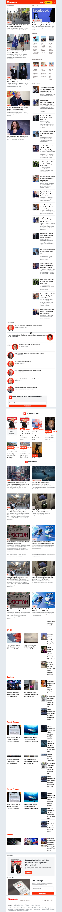

# NewsWeek-Copy
> In this project we made a replica of the news site Newsweek.com using the Bootstrap framework.

- Laptop view

- mobile view

- ipad view

## Built With

- HTML
- CSS

## Live Demo

[Live Demo Link](https://raw.githack.com/LamiaSristy/NewsWeek-Copy/test1/index.html)

## Authors

👤 **Lamia Sristy**

- Github: [@LamiaSristy](https://github.com/LamiaSristy)

👤 **Tiago Alves**

- Github: [@tiagoes](https://github.com/tiagoes)

## 🤝 Contributing

Contributions, issues and feature requests are welcome!

Feel free to check the [issues page](enter issues url here).

## Show your support

Give a ⭐️ if you like this project!

## Acknowledgments

- Hat tip to anyone whose code was used
- Inspiration.